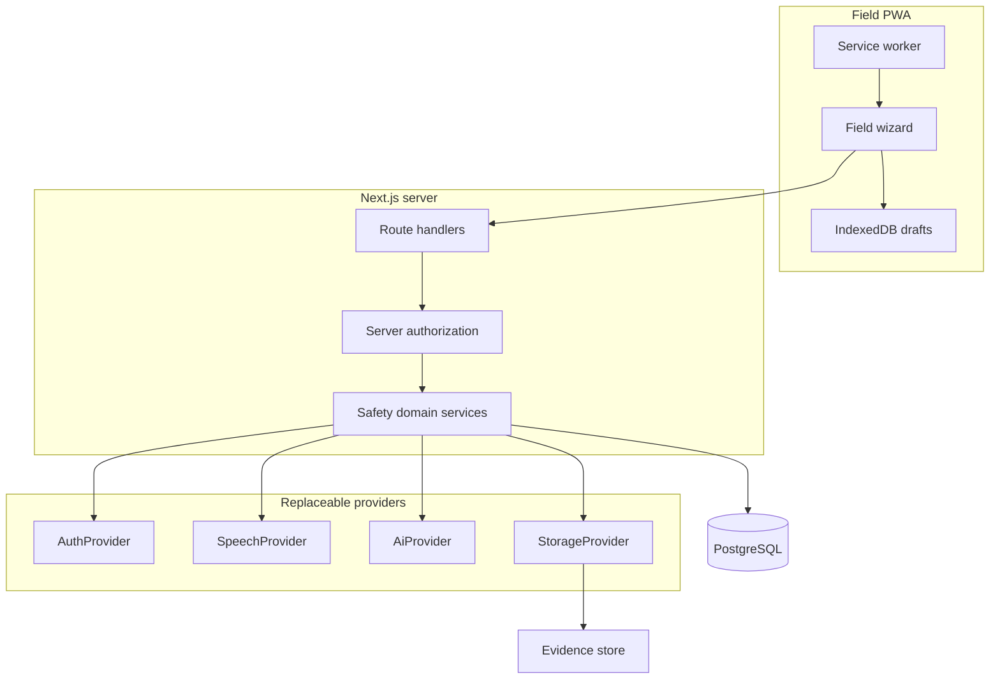

# Architecture

EnergyGuard JRB is a Next.js App Router application with a PostgreSQL system of record, Prisma ORM, and provider interfaces for authentication, speech, AI, and file storage.

## Runtime choices

| Concern | Choice |
|---------|--------|
| UI | React 19 + Next.js App Router + Tailwind CSS 4 |
| Language | TypeScript strict |
| Database | PostgreSQL 16 |
| ORM | Prisma |
| Auth (local) | Mock session cookie |
| Auth (production-ready) | Microsoft Entra ID adapter (`AUTH_PROVIDER=entra`) |
| Speech (local) | Mock + browser Web Speech |
| Speech (production-ready) | Azure AI Speech adapter |
| AI (local) | Deterministic matcher over approved tasks/synonyms |
| AI (production-ready) | Azure OpenAI adapter that may only rank approved records |
| Files (local) | Local `uploads/` directory |
| Files (production-ready) | Azure Blob adapter |
| Offline | PWA + IndexedDB + sync queue |
| Tests | Vitest (unit/integration) + Playwright (e2e/a11y) |

The previous repository used Supabase and Capacitor for a different product. Those are not the EnergyGuard stack.

## Application layers

1. **Field UI** — one-question wizard, no database jargon
2. **HTTP API** — session, RBAC, validation (Zod), rate limits on speech/AI
3. **Domain** — readiness gating, Alternative Control rules, task matching, rebrief/stop-work
4. **Persistence** — Prisma models; JRB versions retain controlled-library version IDs
5. **Providers** — interfaces in `src/lib/providers/*`

Safety workflow code must not import Azure or Entra SDKs directly.

## Route map

| Route | Purpose |
|-------|---------|
| `/` | Home: active briefs or sign-in |
| `/sign-in` | Mock or Entra sign-in |
| `/briefs` | My JRBs |
| `/briefs/new` | Start the Job Brief |
| `/briefs/[id]` | Resume current step |
| `/briefs/[id]/start` | Step 1 |
| `/briefs/[id]/work` | Step 2 voice/library |
| `/briefs/[id]/conditions` | Step 3 |
| `/briefs/[id]/high-energy` | Step 4 |
| `/briefs/[id]/controls` | Step 5 |
| `/briefs/[id]/job-steps` | Step 6 |
| `/briefs/[id]/completeness` | Step 7 |
| `/briefs/[id]/review` | Step 8 |
| `/briefs/[id]/crew` | Step 9 |
| `/briefs/[id]/ready` | Step 10 |
| `/briefs/[id]/closeout` | Post-job |
| `/admin` | Controlled content, imports, exceptions |
| `/admin/audit` | Audit history (authorized roles) |
| `/help/[term]` | Expandable definitions |

API routes live under `/api/auth`, `/api/jrbs`, `/api/speech`, `/api/ai`, `/api/sync`, `/api/evidence`, `/api/admin`.

## Azure alignment

- App Service or Container Apps can run `next start`
- PostgreSQL Flexible Server for `DATABASE_URL`
- Blob Storage for evidence
- Entra ID for workforce identity
- Azure AI Speech and Azure OpenAI behind provider adapters
- Key Vault for secrets (never committed)

## Mermaid entity overview

See `/docs/data-model.md` for the entity-relationship diagram.
