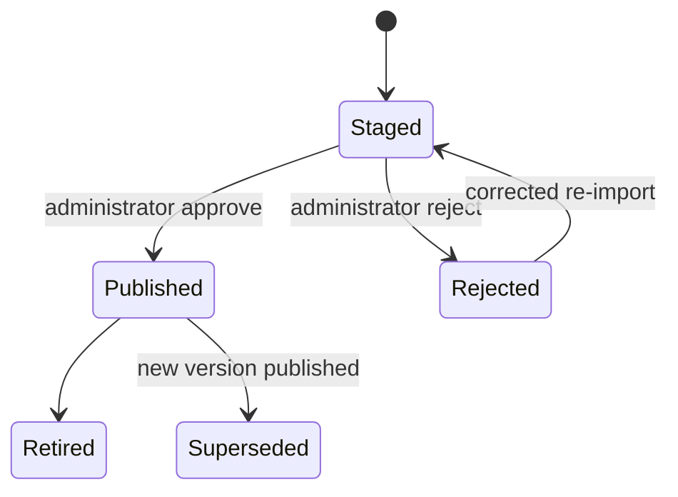

# Controlled-content governance

Controlled safety content is staged, reviewed, published, versioned, retired, and superseded. Field users never edit the library.

## Lifecycle

Every record stores: source filename, source version, effective date when available, import date, content status, source location.

## Who may publish

- EEI Task Library Administrator — work types, activities, tasks, synonyms
- Direct Control Library Administrator — High Energy catalog (with Safety Reviewer), Direct Controls, Logic View mappings
- Alternative Control Administrator — categories and example controls
- Regulatory Content Administrator — citations and applicability help
- Application Administrator — help text, configuration, retention

Two-person rule is configurable (`REQUIRE_DUAL_CONTROL_PUBLISH`). Default local mock is single administrator for development.

## What is not auto-published

- Import output
- AI suggestions
- “Other” Alternative Controls (JRB-specific proposed records + optional admin review)
- Proposed synonyms
- Empty mapping tables (task × High Energy, task × Direct Control, task × PPE)

## Historical JRBs

Release stores `controlledLibrarySnapshot` on `jrb_versions`. Display of a closed JRB uses snapshot IDs.

## Exceptions

Unresolved extraction issues become `controlled_content_exceptions` with status `Unresolved` or `Administrator Review Required`. They are visible on the admin dashboard and must not be hidden.
