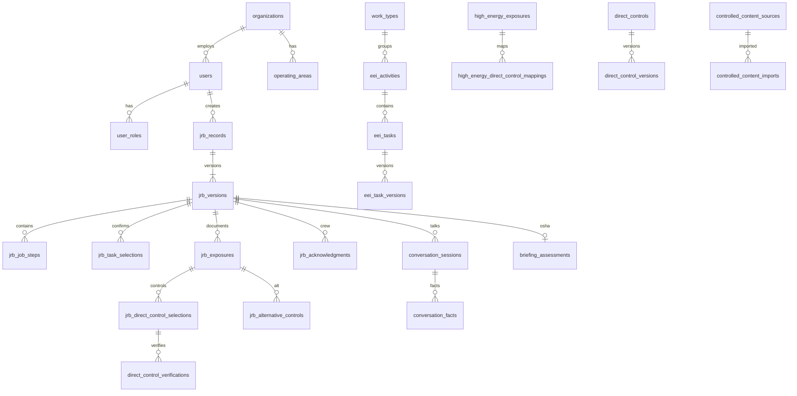

# Data model

PostgreSQL with UUID primary keys. Controlled records are versioned. Completed JRB versions store the library version IDs used at the time of release so later library edits cannot rewrite history.

## Table list

The Prisma schema defines the required entities, including:

organizations, users, user_roles, operating_areas, crews, crew_memberships, contractors, jrb_records, jrb_versions, jrb_job_steps, jrb_conditions, jrb_environmental_conditions, jrb_predeparture_checks, jrb_jobsite_walkdowns, jrb_crew_members, jrb_acknowledgments, jrb_questions, jrb_post_job_reviews, work_types, eei_activities, eei_tasks, eei_task_versions, task_synonyms, task_match_exceptions, jrb_task_selections, high_energy_exposures, high_energy_icon_assets, sclm_classifications, task_high_energy_mappings, jrb_exposures, direct_controls, direct_control_versions, high_energy_direct_control_mappings, task_direct_control_mappings, jrb_direct_control_selections, direct_control_verifications, direct_control_not_used_reasons, alternative_control_categories, alternative_controls, alternative_control_versions, jrb_alternative_controls, ppe_items, task_ppe_mappings, regulatory_references, regulatory_topics, task_regulatory_mappings, conditional_questions, approvals, approval_rules, rebrief_events, stop_work_events, evidence_files, ai_recommendations, audit_events, controlled_content_sources, controlled_content_imports, controlled_content_exceptions, help_content, configuration_settings, conversation_sessions, conversation_facts, briefing_assessments.

## Version retention

Job Location lives on `jrb_records` (`jobLocation`, `streetAddress`, `locationIdentifier`, optional `gpsLatitude` / `gpsLongitude` / `gpsCapturedAt`, plus legacy `workLocation` and `addressOrCoordinates`). It is not versioned with rebriefs, so the same location remains available during Stop Work, Conditions Changed / Rebrief, and post-job closeout. GPS is optional and is never required to complete a JRB.

Conversation intelligence lives on `conversation_sessions` (transcript, provider, `audioDiscarded`) and `conversation_facts` (category, key, value, source segment, confidence, origin, `displayOnJrb`, catalog id). OSHA completeness lives on `briefing_assessments`. Origins are `employee_entered`, `ai_extracted`, `ai_suggested`, `employee_confirmed`, and `modified`. Employee-facing screens only show facts with `displayOnJrb`.

`jrb_versions.controlledLibrarySnapshot` stores JSON of work-type, task, exposure, direct-control, and alternative-control version IDs. Historical reads use the snapshot, not only current lookup tables.

## Audit

`audit_events` is append-only. Application APIs never update or delete rows. Database role for the app user should lack DELETE on that table in production.
