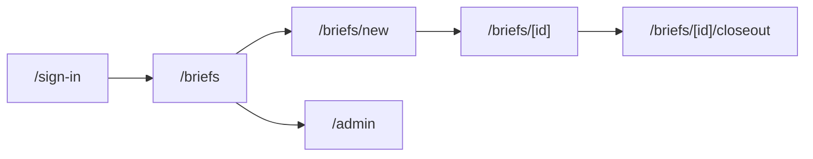

# Application route map

| Path | Screen |
|------|--------|
| `/` | Redirects to briefs or sign-in |
| `/sign-in` | Mock or Entra-ready sign-in |
| `/briefs` | Active JRBs |
| `/briefs/new` | Create draft |
| `/briefs/[id]` | Guided field wizard (10 steps) |
| `/briefs/[id]/closeout` | Post-job review |
| `/admin` | Imports, exceptions, audit |
| `/api/health` | Health |
| `/api/auth/*` | Session |
| `/api/jrbs` | Create/list |
| `/api/jrbs/[id]` | Load/save |
| `/api/jrbs/[id]/stop-work` | Stop Work |
| `/api/jrbs/[id]/rebrief` | New version |
| `/api/jrbs/[id]/release` | Ready for Work release |
| `/api/speech/transcribe` | Speech provider |
| `/api/ai/match-tasks` | Task matching |
| `/api/reference/*` | Published libraries |
| `/api/evidence` | Uploads |
| `/api/sync` | Offline queue |
| `/api/admin` | Governance |
